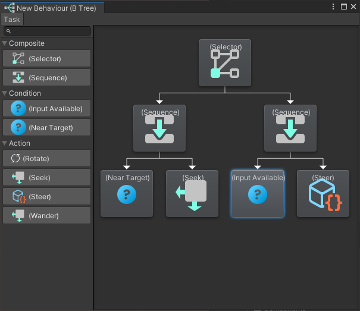
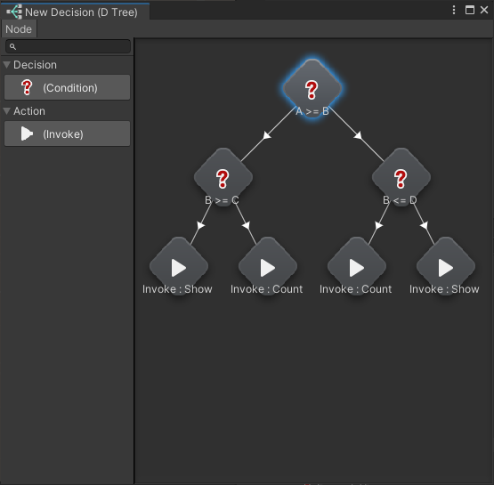

# Character/System Setup Tool

## Behaviour Tree
* Decision making using behaviour tree setup is build using unity editor from scrach.
* Project specific conditions and actions are implemented through extension.
* Visitor character behaviour is setup using this tool, in Zoo Guardians game. 

 

Reference:
[Zoo Guardians](https://nationalzoo.si.edu/zoo-guardians)

## Decision Tree
* Decision making using decision tree setup is build using unity editor from scrach.
* Project specific decisions and actions are implemented through extension.
* Smart store is setup using this tool, in Badlands Blade Battle game. 

 

Reference: 
[Badlands Blade Battle](https://apps.apple.com/us/app/into-the-badlands-blade-battle/id1144419248)