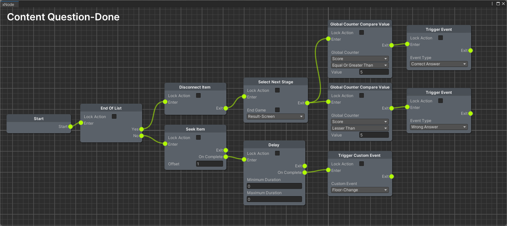
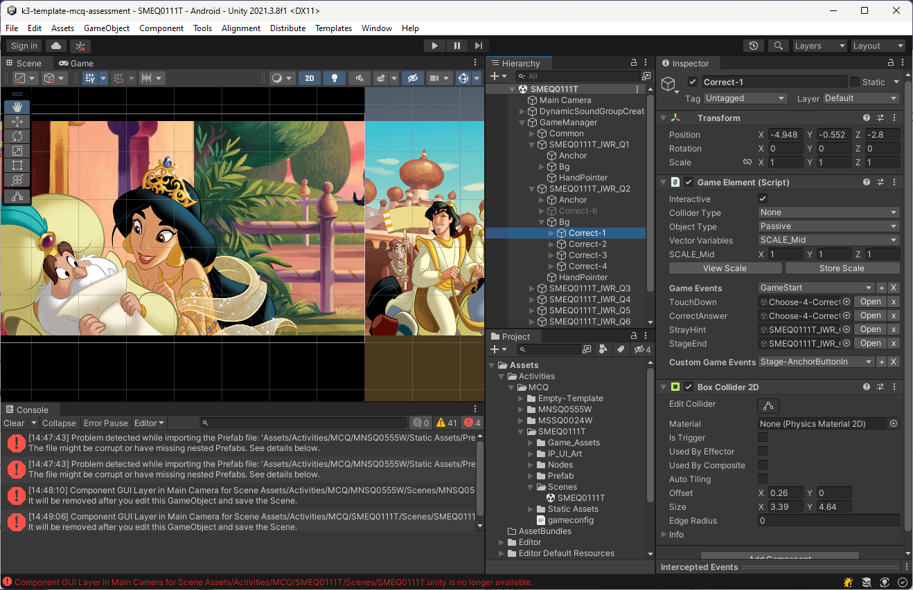

# Game Play Setup Tool
## Game Template Extension
* Game template is built using xNode graph tool, which is used to build 1000's of distinct activity games.
* Created several action nodes for various features like trace, vernacular and assessments.
* Intergrated rest api service in action nodes to load questions from (question bank)backend.

 

Reference:
[Disney • BYJU'S Early Learn app](https://play.google.com/store/apps/details?id=com.byjus.k3&hl=en_IN&gl=US)

Sample assignment of graph in the game stage.. 
 