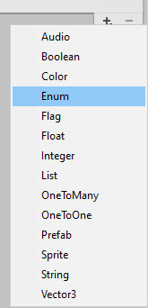

# Create a List

List asset creation menu is added in to "Create" menu. Either from main menu "Assets>Create>List" or from Project window context menu "Create" we can create the list asset.


```csharp
[CreateAssetMenu(fileName ="New List", menuName ="List")]
```


 

A new list asset will be create as follows:

 


### Add property
The properties add drop down menu will list out all the options available as follows:

 

### Rename property
Double click or select again the selected property to give new name to it.

 

### Remove Property
Any selected property can be removed, using the (-) remove option next to add drop down.


### Add Items to List

 

Once we add any property, Items list will be visible to add/remove items to this list. We can now populate number of entity items

Here is the sample list of questions.


 

# Create a new property

Array scriptable object represent the property of an entity in the List. A new property option can be added to List, as follows:
```csharp
public sealed class <property_name> : Array<strong_type>
```
Example:

```csharp
public sealed class Integer : Array<int>{

}
```

for the above example "Interger" property option will be create in list, this will add int value to entity.


### Custom editor to property
ArrayEditor is the base class, it can be used to write custom editor to property and its item in the list.

```csharp
[CustomArrayEditor("Components.Arrays.Sprite")]
public class SpriteArrayEditor : ArrayEditor {

}
```
In the following sample, both string and sprite property are using custom editor to show it value enhanced, this can be activated by toggling the flag from the drop down option available to all the property at it end.

Normal editor will just draw all property in default property editor control.

 .

