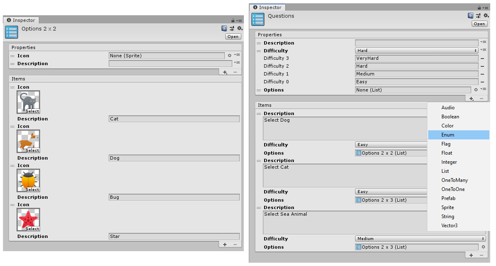
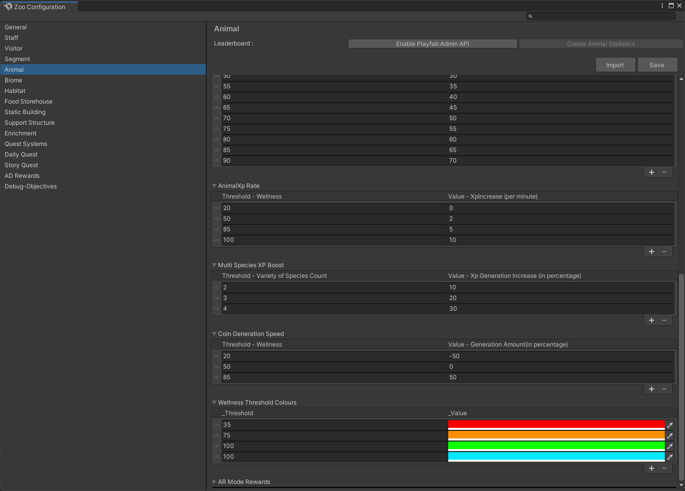
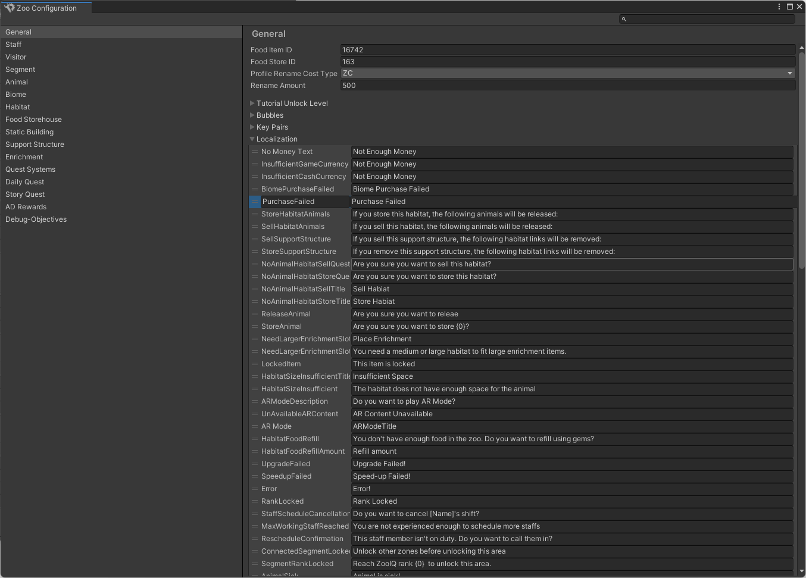

# Configuration Setup Tool

## Entity List Creation Tool 
* Create list asset instantly from asset creation menu, and add its properties to define the entity.
* Once properties are defined, then we can add number of items to it and set it's states.
* This tool is project indepentent and it can be used in building any feature configurations instantly.  

 

[Getting started work flow for this tool found here!](createlist.md).

Reference:
[Disney • BYJU'S Early Learn app](https://play.google.com/store/apps/details?id=com.byjus.k3&hl=en_IN&gl=US)

## Game Configuration Editors
* Abstruct configuration editor window is build using unity editor.
* Project specfic extension are created from the abstract editor.
* Game configuration editor, helps in keeping all the game entities configuration in a neat centralized place.

Here is the sample extension in Zoo Guardian project.
 

Reference:
[Zoo Guardians](https://nationalzoo.si.edu/zoo-guardians)

 

