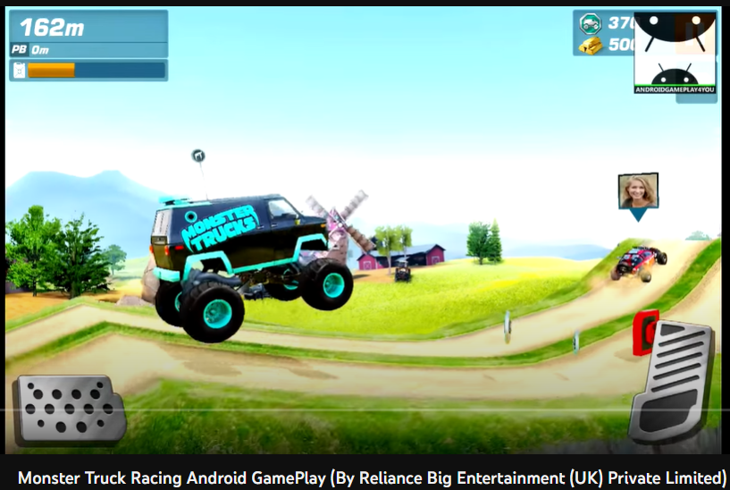

# Level Design tools

## Road track for racing
* Used De Casteljau cubic bezier curve algorithm to build 3D path for a level.
* Using a flat plain mesh, procedurally extruded along its right axis to the path of curve with equal sample segments.

 

Sample output from the gameplay screen shot.. 
 

Reference:
[Monster Trucks Racing](https://apps.apple.com/us/app/monster-trucks-racing/id949846482)

## Trace path for strokes
* Used cubic bezier curve to build 2D path on the screen for user to trace on it.
* Used next derivation of the curve and compared it with the direction of the user input drag to progress on tracing.

 

Reference:
[Disney • BYJU'S Early Learn app](https://play.google.com/store/apps/details?id=com.byjus.k3&hl=en_IN&gl=US)